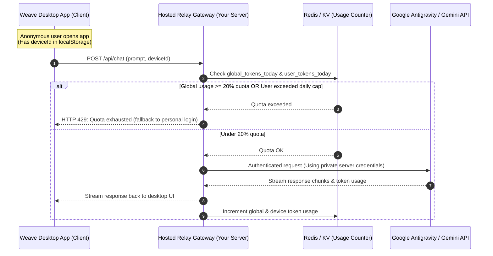

# Community Quota Gateway: Sharing 20% of Google CLI / Antigravity Quota

Architecture and implementation plan for offering a zero-setup, free-tier experience in Weave by sharing up to 20% of your Google CLI (`agy` / Gemini) quota with users who download the app.

---

## 1. The Core Problem & Security Constraint

When distributing a desktop application like Weave to users, two goals conflict:
1. **Zero-setup UX**: The user should download and use the app immediately without signing in to Google, installing `agy`, or configuring API keys.
2. **Strict Quota & Identity Control**: The user must only use up to 20% of the host's quota, and the host's private credentials must remain completely secure.

### Why Credentials Cannot Be Bundled in the Desktop App
> [!CAUTION]
> **Never embed Google OAuth refresh tokens, service account keys, or API keys inside the client app bundle, installer, or `.env`.**
>
> 1. **Credential Extraction**: Any user can open DevTools, inspect memory, or run `strings Weave.app` to extract the embedded key.
> 2. **Client-Side Enforcement is Bypassed Easily**: If the 20% limit check is performed client-side, any modified client can disable the check and consume 100% of your quota or incur large API bills.
> 3. **Google Account Risks**: High-volume, multi-IP requests made using a personal OAuth token can trigger account fraud detection and suspension.

---

## 2. Target Architecture: The Hosted Relay Gateway

To achieve both **zero setup** and **hard 20% quota enforcement**, all requests for the shared tier flow through a lightweight **Gateway Relay Server** operated by you:



---

## 3. Two-Tier Quota Enforcement Strategy

The 20% quota must be protected both against aggregate community exhaustion and individual abuse.

### Tier 1: Global Hard Cap (20% Pool)
* Compute 20% of your total Google daily allowance.
  * *Example*: If your account tier allows 1,000,000 tokens/day, `GLOBAL_DAILY_CAP = 200,000` tokens.
* Reset counter daily at midnight UTC (`00:00 UTC`).
* Once `global_tokens_today >= 200,000`, the relay rejects further requests from the free tier with:
  ```json
  {
    "error": "community_limit_reached",
    "message": "Today's free community quota (20%) is exhausted. Resets at 00:00 UTC, or sign in with your personal account."
  }
  ```

### Tier 2: Per-Device Fair-Share Throttling
* Prevents a single malicious or high-intensity user from eating up the entire 20% global pool.
* Upon first launch, the desktop app generates an anonymous `deviceId`:
  ```ts
  const deviceId = localStorage.getItem("weave_device_id") ?? crypto.randomUUID();
  localStorage.setItem("weave_device_id", deviceId);
  ```
* Set a per-device daily cap:
  * *Example*: `DEVICE_DAILY_CAP = 15,000` tokens (or ~25 interactions per day per user).
* Once a user crosses their fair share, prompt them to sign in with their own account.

---

## 4. Integration into Weave

### A. Engine Registry Configuration
In [`packages/agent/src/engines-registry.ts`](file:///Users/xyz/Coding/weave/packages/agent/src/engines-registry.ts), add a dedicated engine entry for the shared relay:

```typescript
export const ENGINES: Record<string, EngineDescriptor> = {
  "antigravity-shared": {
    id: "antigravity-shared",
    label: "Google Antigravity (Free 20% Tier)",
    packageName: "weave-community-gateway",
    binName: "gateway",
    provider: "google",
    capabilities: {
      streaming: true,
      toolCalls: true,
      fileEditing: true,
      permissions: true,
      resume: false,
      handoff: false,
    },
  },
  "antigravity": {
    id: "antigravity",
    label: "Google Antigravity (Local Account)",
    packageName: "agy-acp",
    binName: "agy-acp",
    provider: "google",
    args: ["--no-sandbox"],
    capabilities: FULL_CAPABILITIES,
  },
  // ...
};
```

### B. Client Request Layer
In [`apps/desktop/src/useAcpChat.ts`](file:///Users/xyz/Coding/weave/apps/desktop/src/useAcpChat.ts):
* When `engineId === "antigravity-shared"`, the app streams turns to `https://gateway.yourdomain.com/v1/stream` with `X-Weave-Device-ID: <deviceId>`.
* The response streams tokens directly into `ChatTurn.text` and `ChatTurn.tools`.

### C. Quota Visibility & Fallback in the UI
1. **Quota Indicator** ([`UsageLimitIsland.tsx`](file:///Users/xyz/Coding/weave/apps/desktop/src/features/quota/UsageLimitIsland.tsx)):
   * Display the community pool utilization in the top-bar status pill:
     `Community Pool: 14% / 20% Used`
2. **Graceful Exhaustion Dialog** ([`EngineAuthPanel.tsx`](file:///Users/xyz/Coding/weave/apps/desktop/src/features/auth/EngineAuthPanel.tsx)):
   * When the relay returns HTTP 429, show an actionable card:
     > **"Community Free Tier Limit Reached"**
     > *"You've used the available free quota for today. Connect your own Google account or Antigravity CLI to continue without limits."*
   * A button switches `engineId` to `"antigravity"` and launches the local `agy auth login` terminal flow.

---

## 5. Reference Relay Implementation (Cloudflare Worker / Node.js)

Here is a minimal edge relay implementation using Cloudflare Workers and Upstash Redis:

```typescript
// worker.ts (Hosted on Cloudflare Workers / Node.js)
import { GoogleGenAI } from "@google/genai";
import { Redis } from "@upstash/redis";

const redis = Redis.fromEnv();
const ai = new GoogleGenAI({ apiKey: process.env.MY_GOOGLE_API_KEY }); // Secure on server!

const GLOBAL_20_PERCENT_LIMIT = 200_000; // tokens/day
const PER_DEVICE_LIMIT = 15_000;         // tokens/day

export default {
  async fetch(req: Request): Promise<Response> {
    if (req.method !== "POST") return new Response("Not found", { status: 404 });

    const deviceId = req.headers.get("X-Weave-Device-ID");
    if (!deviceId) return new Response("Missing Device ID", { status: 400 });

    const today = new Date().toISOString().slice(0, 10);
    const globalKey = `usage:global:${today}`;
    const userKey = `usage:user:${deviceId}:${today}`;

    // 1. Check existing usage
    const [globalTokens, userTokens] = await Promise.all([
      redis.get<number>(globalKey).then((v) => v ?? 0),
      redis.get<number>(userKey).then((v) => v ?? 0),
    ]);

    if (globalTokens >= GLOBAL_20_PERCENT_LIMIT) {
      return new Response(
        JSON.stringify({
          error: "global_quota_exceeded",
          message: "The 20% community quota has been reached for today.",
        }),
        { status: 429, headers: { "Content-Type": "application/json" } },
      );
    }

    if (userTokens >= PER_DEVICE_LIMIT) {
      return new Response(
        JSON.stringify({
          error: "user_quota_exceeded",
          message: "You have reached your daily free limit. Sign in to your own account to continue.",
        }),
        { status: 429, headers: { "Content-Type": "application/json" } },
      );
    }

    const { prompt } = await req.json();

    // 2. Stream generation from Google
    const stream = await ai.models.generateContentStream({
      model: "gemini-2.5-flash",
      contents: prompt,
    });

    // 3. Track tokens (approximate or extracted from stream response)
    const estimatedTokens = Math.ceil(prompt.length / 4) + 500;
    await Promise.all([
      redis.incrby(globalKey, estimatedTokens),
      redis.incrby(userKey, estimatedTokens),
    ]);

    // Return readable stream to client
    return new Response(stream as unknown as BodyInit, {
      headers: { "Content-Type": "text/event-stream" },
    });
  },
};
```

---

## 6. Security Checklist Before Launch

- [ ] **No Secrets in Git or Dist**: Verify `git status` and binary strings (`strings Weave.app | grep -i "AIza"`) to ensure no keys leak into client artifacts.
- [ ] **Server-Side API Key Only**: The Google API Key or OAuth token exists exclusively as an environment secret in the hosted relay.
- [ ] **CORS & Origin Filtering**: Restrict relay CORS headers to Tauri origins (`tauri://localhost` and `http://localhost:1420`).
- [ ] **Per-IP Rate-Limiting**: Protect the relay endpoint against DDoS using Cloudflare WAF rate-limiting.
- [ ] **Daily Reset Expiry**: Set Redis keys with a TTL of 86,400 seconds (24h) to avoid stale unbounded counters.
